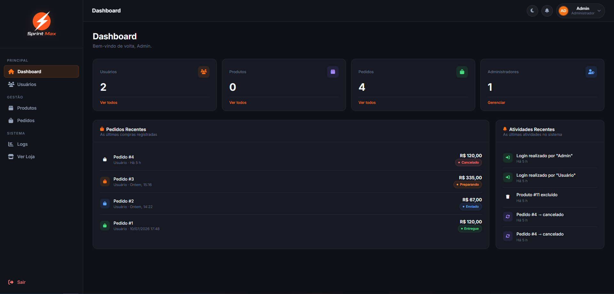

# 🚀 Sprint Max

Um sistema de gerenciamento de loja desenvolvido com **PHP Puro**, **MySQL**, **HTML**, **CSS** e **JavaScript**.

O projeto começou como um CRUD simples e está evoluindo para um **mini e-commerce funcional**, onde administradores gerenciam a loja e clientes podem visualizar produtos, adicionar ao carrinho e realizar pedidos.

---

## 📸 Preview

<p align="center">
    
</p>

---

## ✨ Funcionalidades

### 👑 Administrador

- Dashboard com estatísticas
- Cadastro de produtos
- Edição de produtos
- Exclusão de produtos
- Controle de estoque
- Gerenciamento de usuários
- Visualização de todos os pedidos
- Alteração do status dos pedidos
- Logs de atividades

### 👤 Usuário

- Visualizar produtos
- Pesquisar produtos
- Filtrar por categorias
- Adicionar produtos ao carrinho
- Remover produtos do carrinho
- Alterar quantidade
- Finalizar compra
- Visualizar pedidos
- Favoritar produtos
- Editar perfil

---

## 🛠️ Tecnologias

- HTML5
- CSS3
- JavaScript
- PHP
- MySQL
- PDO
- Bootstrap 5
- Font Awesome

---

## 📁 Estrutura

```text
Sprint-Max/
│
├── app/
│   ├── config/
│   ├── controller/
│   └── includes/
│
├── assets/
│   ├── css/
│   ├── js/
│   ├── img/
│   └── uploads/
│
├── auth/
│   ├── cadastro/
│   ├── login/
│   ├── logout/
│   └── session/
│
├── pages/
│   ├── carrinho/
│   ├── dashboard-usuario/
│   ├── dashboard/
│   ├── favoritos/
│   ├── home/
│   ├── pedidos/
│   ├── perfil/
│   ├── produtos/
│   ├── relatorios/
│   ├── usuarios/
│   └── vendas/
│    
├── uploads/
│   └── imagens/    
│
├── .htaccess
│
├── banco-migration.sql
│
├── index.php
│
└── routes.php
```

---

## 🗄️ Banco de Dados

O sistema utiliza MySQL.

Principais tabelas:

- usuarios
- produtos
- pedidos / pedido_itens
- favoritos
- notificacoes
- tags / produto_tags
- recuperacao_senha
- logs

> O carrinho é mantido em sessão (`$_SESSION['cart']`), não em tabela.

---

## 🔑 Tipos de Usuário

### Administrador

Possui acesso completo ao sistema.

Pode:

- Gerenciar produtos
- Gerenciar usuários
- Gerenciar pedidos
- Visualizar dashboard
- Visualizar logs

### Usuário

Pode apenas:

- Navegar pela loja
- Comprar produtos
- Gerenciar carrinho
- Visualizar seus pedidos
- Editar perfil

---

## 🚀 Como executar

### 1 Clone o repositório

```bash
git clone https://github.com/destypc/sprint-max.git
```

### 2 Abra o projeto

Coloque a pasta dentro do diretório do XAMPP.

Exemplo:

```text
htdocs/sprint-max
```

### 3 Crie o banco

Crie um banco MySQL.

Importe o arquivo SQL localizado em:

```text
banco-migration.sql
```

### 4 Configure a conexão

Para desenvolvimento local **não é preciso editar nada**: sem variáveis de
ambiente, o `app/config/conexao.php` usa os padrões do XAMPP
(`localhost`, usuário `root`, sem senha, banco `crud-sistema`).

Se o seu ambiente for diferente, defina as variáveis `MYSQLHOST`, `MYSQLPORT`,
`MYSQLDATABASE`, `MYSQLUSER`, `MYSQLPASSWORD` (ver `.env.example`).

### 5 Execute

Inicie o Apache e o MySQL pelo XAMPP e acesse:

```text
http://localhost/sprint-max
```

**Login inicial** (criado pelo `banco-migration.sql`):
`admin@sprintmax.com` / `admin123` — troque a senha após o primeiro acesso.

---

## ☁️ Deploy em produção

Este app usa PHP + MySQL + upload de arquivos, então **não roda bem em
plataformas serverless** (Vercel/Netlify): o filesystem é efêmero e não há
MySQL nativo. O deploy recomendado é via **Docker no Railway** (container
persistente + MySQL gerenciado + volume para uploads).

👉 Passo a passo completo em **[`DEPLOY.md`](DEPLOY.md)**.

---

## 📌 Funcionalidades implementadas

- [x] Carrinho de compras
- [x] Favoritos
- [x] Upload de imagens
- [x] Dashboard administrativo
- [x] Histórico de pedidos
- [x] Controle de estoque
- [x] Tema claro/escuro
- [x] Responsividade completa
- [x] Sistema de notificações
- [x] Relatórios
- [x] Dashboard do usuário

---

## 🎯 Objetivo

Este projeto foi desenvolvido com o objetivo de praticar conceitos de:

- PHP
- CRUD
- PDO
- MySQL
- Sessões
- Autenticação
- Permissões
- Organização de código
- Desenvolvimento Web

---

## 👨‍💻 Autor

**Enzo**

- GitHub: https://github.com/destypc

---

## ⭐ Gostou do projeto?

Se este projeto foi útil ou interessante para você, deixe uma ⭐ no repositório!
